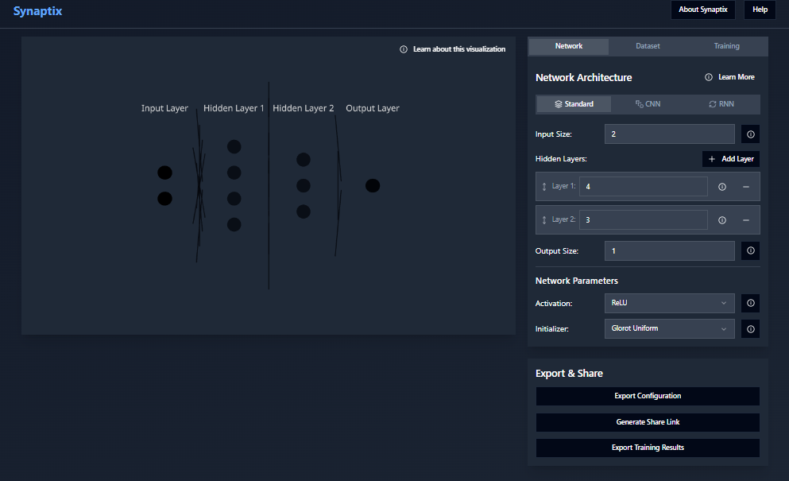

# 🧠 Synaptix  
**Visualize Neural Networks Like Never Before**  
Real-time, interactive exploration of how artificial neurons connect, learn, and evolve.

---


*This is how Synaptix looks in action.*


## 🚀 Overview

**Synaptix** is a dynamic web-based tool that allows you to **visualize, interact with, and understand** the training and behavior of neural networks in real-time. Whether you're a curious student, a CS educator, or a seasoned AI practitioner, Synaptix opens the black box of deep learning through vivid, step-by-step animations and intuitive explanations.

> _“What a neuron sees, Synaptix shows.”_

---

## 🎯 Key Features

- 🔄 **Live Training Visualization**: Watch forward pass, backpropagation, and weight updates as they happen.
- 🧩 **Modular Network Builder**: Drag-and-drop layers, set activations, adjust sizes.
- 📊 **Activation & Gradient Maps**: See how each layer transforms data.
- ⏯️ **Step-by-Step Debugger**: Pause, rewind, and inspect each computation.
- 🌈 **Custom Data & Problems**: Train on your own 2D datasets or choose built-in challenges (e.g., XOR, spiral).
- 🧠 **Explainer Mode**: Toggle human-readable insights on loss functions, overfitting, or optimization.

---

## 🧰 Tech Stack

| Frontend              | Backend (optional)        | Other Integrations       |
|-----------------------|---------------------------|---------------------------|
| React.js              | Node.js / Flask (optional)| TensorFlow.js             |
| D3.js / Canvas        | Express / REST API        | Anime.js, Chart.js        |
| TailwindCSS / CSS3    | Firebase (for session save)| MathJax (for math rendering)|

---

## 🧪Run locally:

```bash
git clone https://github.com/ju-baer/Synaptix
cd Synaptix
npm install
npm run dev
